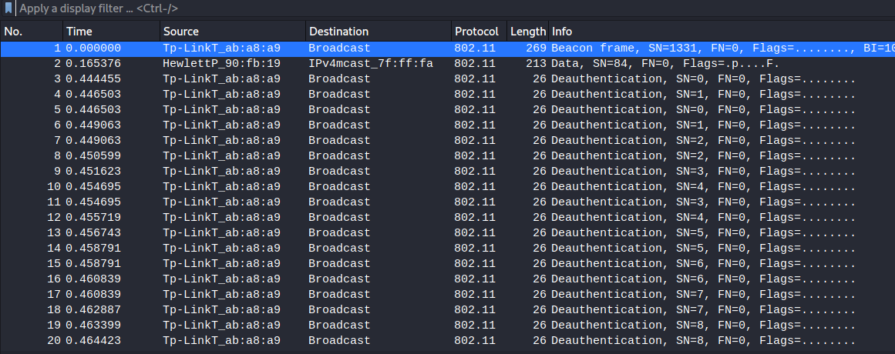
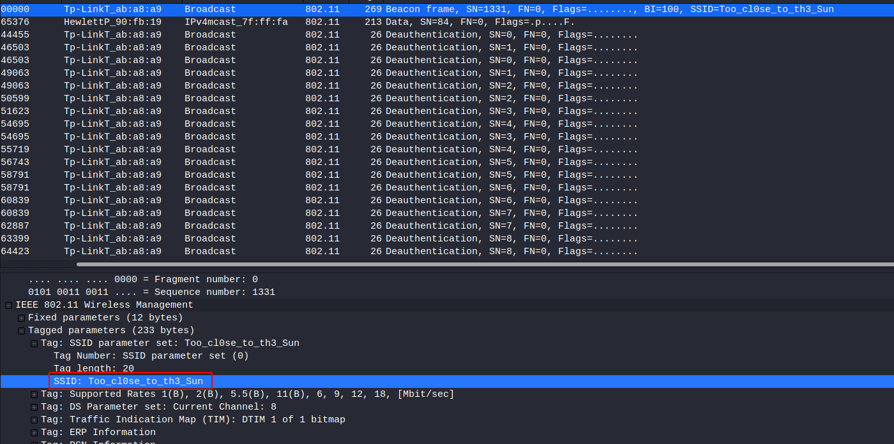

# Shell

A weird file `captured.cap` exists on the `airgeddon` directory.
Let's download it and analyse with wireshark.

```bash
pwd
/home/zeus/airgeddon/captured
ls -la
total 304
drwxr-xr-x 1 zeus zeus   4096 Apr  8  2018 .
drwxr-xr-x 1 zeus zeus   4096 Apr  8  2018 ..
-rw-r--r-- 1 zeus zeus 297917 Apr  8  2018 captured.cap
-rw-r--r-- 1 zeus zeus     57 Apr  8  2018 papyrus.txt
cat papyrus.txt
Captured while flying. I'll banish him to Olympia - Zeus
```

This is a `Tp-Link` router interception. Try to crack his `master key` with `aircrack`.



```bash

                               Aircrack-ng 1.6 

      [00:13:03] 8029012/14344394 keys tested (10406.61 k/s) 

      Time left: 10 minutes, 6 seconds                          55.97%

                        KEY FOUND! [ flightoficarus ]


      Master Key     : FA C9 FB 75 B7 7E DC 86 CC C0 D5 38 88 75 B8 5A 
                       88 3B 75 31 D9 C3 23 C8 68 3C DB FA 0F 67 3F 48 

      Transient Key  : 0C 5C 1C 84 60 FA 34 DE C0 4F 35 F6 4F 03 A2 0F 
                       8F 6F 5E 20 05 27 E1 73 E0 73 F5 F1 2D AF D1 17 
                       8B F8 27 C6 BE 23 E3 70 8A EF 4A CC CA 0B EE 00 
                       00 00 00 00 00 00 00 00 00 00 00 00 00 00 00 00 

      EAPOL HMAC     : AC 1A 73 84 FB BF 75 9C 86 CF 5B 5A F4 8A 4C 38
```

We have a potential user : `icarus`
The `SSID` seems to be a password.



```bash
$ ssh icarus@10.10.10.83 -p 2222
The authenticity of host '[10.10.10.83]:2222 ([10.10.10.83]:2222)' can't be established.
ECDSA key fingerprint is SHA256:uyZtmsYFq/Ac58+SEgLsL+NK05LlH2qwp2EXB1DxlO4.
Are you sure you want to continue connecting (yes/no/[fingerprint])? yes
Warning: Permanently added '[10.10.10.83]:2222' (ECDSA) to the list of known hosts.
icarus@10.10.10.83's password: Too_cl0se_to_th3_Sun
Last login: Sun Apr 15 16:44:40 2018 from 10.10.14.4
icarus@620b296204a3:~$
```
